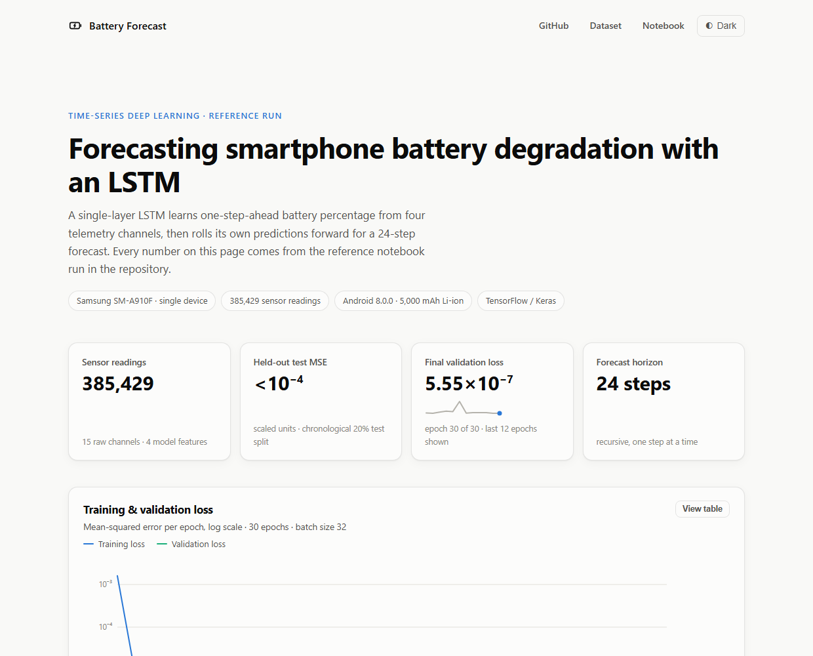
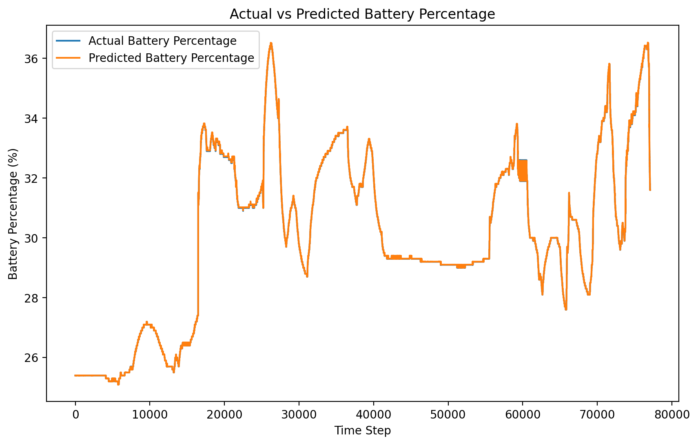
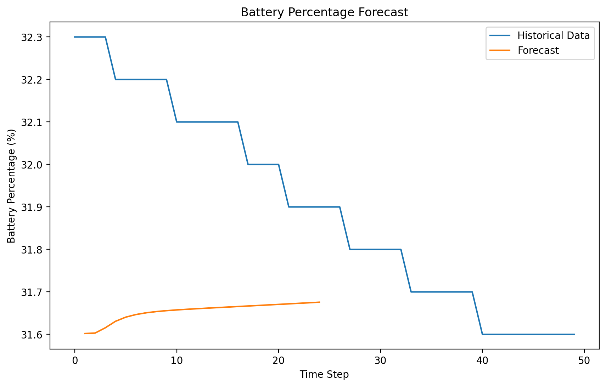

<div align="center">

# 🔋 Forecasting Smartphone Battery Degradation with an LSTM

**An end-to-end time-series pipeline — from a raw 385K-row sensor export to a
trained Keras LSTM and an interactive results dashboard.**

[](https://www.python.org/)
[](https://www.tensorflow.org/)
[](LICENSE)
[](https://battery-forecast-dashboard.onrender.com/)

[**Live dashboard**](https://battery-forecast-dashboard.onrender.com/) ·
[Notebook](notebooks/battery_degradation_forecasting.ipynb) ·
[Model card](models/README.md) ·
[Dataset (Kaggle)](https://www.kaggle.com/datasets/rahulgarg28/mobile-battery-with-time)



</div>

---

## Overview

A single-layer LSTM learns one-step-ahead battery percentage from four telemetry
channels (battery %, running apps, CPU usage, voltage), then rolls its own
predictions forward for a 24-step forecast. The dataset is 385,429 readings from
a single Samsung SM-A910F (Android 8.0.0, 5,000 mAh Li-ion).

The project ships as three complementary artifacts:

| Artifact | What it's for |
|---|---|
| [`notebooks/`](notebooks/battery_degradation_forecasting.ipynb) | The narrated analysis — cleaning, EDA, training, forecasting |
| [`src/battery_forecast/`](src/battery_forecast) | The same pipeline as a typed, installable package with a CLI |
| [`docs/`](docs) | A dependency-free interactive dashboard of the reference run |

## Results (reference run)

| Metric (scaled units) | Value |
|---|---|
| Final training loss (epoch 30) | 1.72 × 10⁻⁶ |
| Final validation loss | 5.55 × 10⁻⁷ |
| Held-out test MSE (20% chronological split) | < 10⁻⁴ |

Loss collapses by three orders of magnitude within five epochs, and the
validation curve tracks training closely — no sign of overfitting.

> **Read the metrics honestly.** Battery percentage changes slowly relative to
> the sampling rate, so a model that closely tracks the previous reading already
> achieves a tiny one-step MSE. Benchmark against a persistence baseline before
> drawing conclusions about forecasting skill — see
> [Limitations](#limitations--roadmap).

| Held-out test set | 24-step forecast |
|---|---|
|  |  |

## Quickstart

Requires Python ≥ 3.10 and [uv](https://docs.astral.sh/uv/).

```bash
git clone https://github.com/Abdullah-Masood-05/BatteryDegForecastLSTM.git
cd BatteryDegForecastLSTM

# create the environment and install the package (+ notebook extras)
uv venv
uv pip install -e ".[notebooks]"

# download the dataset (Kaggle credentials required — see data/README.md)
uvx kaggle datasets download -d rahulgarg28/mobile-battery-with-time -p data --unzip
```

### Train, evaluate, forecast

```bash
# train (chronological 80/20 split, 10% validation) and save the model
uv run battery-forecast train --data data/battery_dataset.csv \
    --model-out models/battery_lstm_model.h5 --history-out reports/history.json

# 24-step recursive forecast with the saved model
uv run battery-forecast forecast --horizon 24
```

Or use the package directly:

```python
from battery_forecast import TrainingConfig
from battery_forecast.train import train

result = train("data/battery_dataset.csv", config=TrainingConfig(epochs=30))
print(result.test_mse)
```

### Explore the notebook

```bash
uv run jupyter lab notebooks/battery_degradation_forecasting.ipynb
```

### View the dashboard locally

The dashboard is a single self-contained HTML file — no build step, no
dependencies:

```bash
python -m http.server -d docs 8000   # then open http://localhost:8000
```

Hosted version: the dashboard deploys to [Render](https://render.com/) as a
static site from `render.yaml` (publish path `docs/`, auto-deploy on push) and
serves at <https://battery-forecast-dashboard.onrender.com/>. GitHub Pages
(`main` / `docs`) works as an alternative host.

## Project structure

```
├── data/                     # dataset lives here (gitignored) — see data/README.md
├── docs/                     # interactive dashboard (GitHub Pages)
│   ├── index.html
│   └── assets/               # figures + training history exported from the notebook
├── models/                   # trained model + model card
│   ├── battery_lstm_model.h5
│   └── README.md
├── notebooks/
│   └── battery_degradation_forecasting.ipynb
├── scripts/
│   └── export_notebook_assets.py   # refresh docs/assets from the executed notebook
├── src/battery_forecast/     # installable pipeline package
│   ├── config.py             # columns, paths, hyperparameters
│   ├── data.py               # load + clean the raw export
│   ├── features.py           # scaling, windowing, chronological split
│   ├── model.py              # LSTM definition & persistence
│   ├── train.py              # end-to-end training run
│   ├── forecast.py           # recursive multi-step forecasting
│   └── cli.py                # `battery-forecast` entry point
└── pyproject.toml
```

## How it works

1. **Ingest** — the raw Kaggle CSV ships with an unusable header; 15 descriptive
   column names are applied and the header row skipped.
2. **Clean** — numeric coercion, boolean mapping, timezone-aware timestamps
   (Asia/Karachi), and removal of fully-empty columns.
3. **Scale & window** — four channels min-max scaled to [0, 1]; sliding 24-step
   windows are labelled with the next battery reading.
4. **Train** — `LSTM(50, relu) → Dense(1)`, Adam on MSE, 30 epochs, batch 32,
   chronological 80/20 split with 10% validation.
5. **Forecast** — 24 recursive steps; each prediction is rolled back into the
   input window.

Architecture details and reference metrics live in the
[model card](models/README.md).

## Limitations & roadmap

**Current limitations**

- **Single device** — no evidence of generalization to other hardware, OS
  versions, or usage patterns.
- **Persistence-flattered metric** — the near-zero MSE is partly explained by
  the slow-moving target; a persistence baseline comparison is the missing
  control.
- **Frozen future inputs** — recursive forecasting holds exogenous channels at
  zero, limiting long-horizon realism.
- **No true degradation signal** — the dataset covers charge level over weeks,
  not battery health over years.

**Roadmap**

- [ ] Persistence / ARIMA baselines alongside the LSTM
- [ ] Multi-device dataset and cross-device validation
- [ ] Joint forecasting of exogenous channels (or teacher forcing at inference)
- [ ] Hyperparameter search (sequence length, units, dropout) and attention/Transformer variants
- [ ] Native `.keras` model format and CI for the package

## Acknowledgements

- Dataset: [Mobile Battery with Time](https://www.kaggle.com/datasets/rahulgarg28/mobile-battery-with-time)
  by Rahul Garg (Kaggle).

## License

[MIT](LICENSE) © Abdullah Masood
